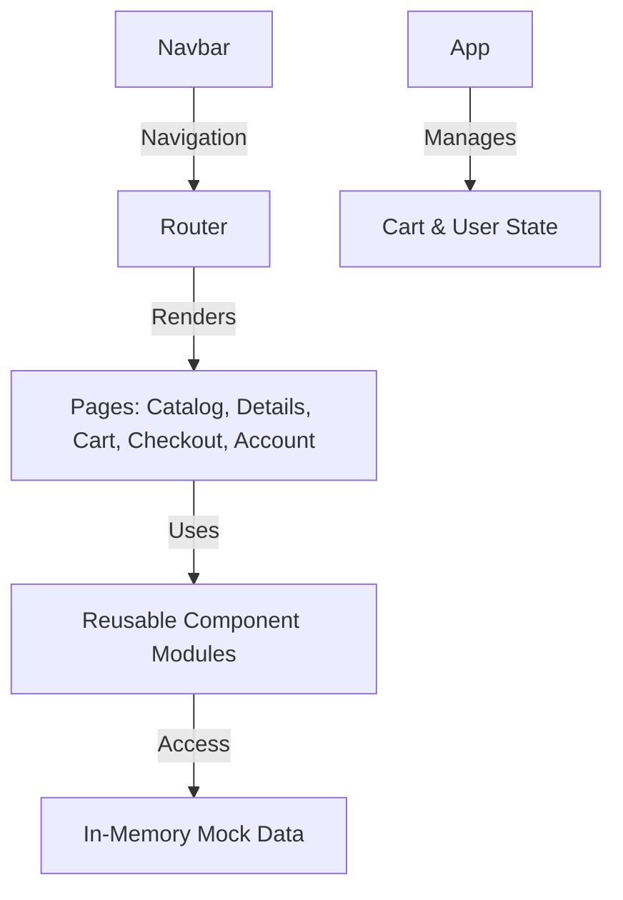

# AutoPartHub Main Container: Implementation Plan and Architecture

## Project Context

AutoPartHub is a modern web application designed for users to browse, search, and purchase automobile spare parts online. The main container serves as the foundational architecture for the platform's user-facing frontend. The objective is to deliver a seamless e-commerce experience with a minimal, responsive, and user-friendly React JS interface. This initial iteration features a clean light theme, modular component design, and uses only mocked data due to the absence of a backend. All business features are being constructed from the ground up, with only template files present initially.

## Architecture Highlights

### High-Level Overview

The system adopts a single-page application (SPA) architecture using React JS with modular components, enabling maintainability and future extensibility. Routing is managed by `react-router-dom` to support a multipage-like flow (e.g., Catalog, Details, Cart, Checkout, User Account). The application maintains a centralized global state for cart and user session management. Theming leverages a custom light gray/white palette, and all data is mocked in the frontend.

#### System Diagram (Mermaid Syntax)

## Technology Stack

- **Frontend Framework:** React JS (JavaScript, ES6+)
- **Routing:** react-router-dom (to be installed)
- **Styling/Theming:** CSS (custom properties/variables, light gray/white color palette)
- **State Management:** React built-in state (useState/useContext or useReducer)
- **Testing:** jest/testing-library (template only)
- **Backend:** None (all product/user data is client-side mocks)

## Key Components & Pages

- **Main Container (`App.js`)**: Entry point, wraps the router and global providers.
- **Navigation Bar**: Top-level, persistent navigation for Catalog, Cart, and Account.
- **Product Catalog**: Grid display, supports filtering and sorting spare parts.
- **Product Detail Page**: Detailed part information, specifications, add-to-cart.
- **Shopping Cart**: Shows selected items, supports add/remove/update.
- **Checkout**: Mocked order form, confirmation page, (no real payments).
- **User Account Pages**: Register/login forms, editable profile, order history (mocked).
- **Global State**: Manages cart contents, user session, and preferences.
- **Theming/Layout**: Responsive CSS for desktop/mobile, consistent color scheme.

## Step-by-Step Development Plan

1. **Install and Setup react-router-dom**
   - Integrate for client-side navigation between main pages.
2. **Establish Main Container and Layout**
   - Refactor App.js for a persistent navbar, content outlet, and route setup.
3. **Implement Navigation Bar**
   - Add links for Catalog, Cart, Account.
4. **Build Product Catalog Page**
   - Grid of mocked items with filter/sort controls.
5. **Create Product Details Page**
   - Route param for specific product, detailed specs and add-to-cart button.
6. **Develop Shopping Cart**
   - Cart view, add/remove/update items, display totals.
7. **Develop Checkout Flow**
   - Form for order details, mock confirmation page.
8. **User Account Management**
   - Simple profile and order history using only local/mocked data.
9. **Wire Up Global State**
   - Use React context/provider for cart/user; propagate relevant state.
10. **Apply Consistent Theming**
    - Utilize CSS variables in App.css, ensure light/gray UI, mobile responsiveness.
11. **Visual Verification**
    - Manually check layout/components and page navigation.
12. **Document Known Issues and Recommendations**

## Known Issues / Constraints

- **Dependency Requirement:** Must install `react-router-dom` for routing.
- **Data/Logic Limitation:** All business data (products, user, orders) is mocked in-memory; no real backend or persistence.
- **Security/Validation:** Forms and authentication are demo-only (do not enforce real security).
- **No Real Payments:** Checkout is a mock form, not integrated with actual payment gateways.

## Optional Next Steps / Recommendations

- **Add Page Transitions**: Animated navigation for polished user experience.
- **Integrate Real APIs**: Replace mock data with backend or third-party API connections.
- **Comprehensive Testing**: Implement Jest/RTL test suites for components, flows, and state.
- **Accessibility Improvements**: Enhance ARIA markup and keyboard/screen reader support.
- **Refactor for Scalability**: Modularize state/context, abstract product data fetching, and add error boundaries.

## Summary

This implementation plan provides the technical and practical blueprint for building the Main Container of AutoPartHub. It prioritizes a clean, modular layout using React JS, anticipates future integration needs, and addresses both the immediate steps and forward-looking architectural improvements to foster continuous development.
proceed