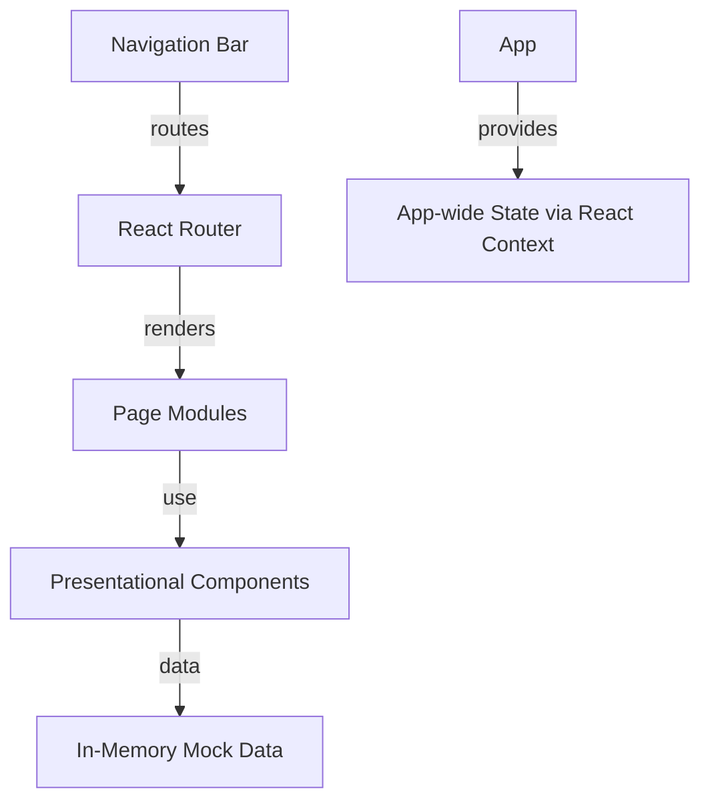

# AutoPartHub: New Implementation Plan and Architecture

## High-Level Summary

AutoPartHub is a modular, React-based web application designed for users to browse and purchase car spare parts online. The project's latest fresh plan emphasizes a clean-slate architecture focused on scalability, maintainability, and a modern user experience. Core priorities include a robust routing setup, persistent navigation components, reusable presentational modules, mock in-memory data for development, and a global app state managed via React Context. The theming is explicitly modern and light, and the overall structure is extensible to accommodate future API, backend, or advanced feature integration.

---

## Architecture Overview

### Design Principles

- **Modular**: Each major feature or UI section is organized as an independent module/component for clarity and reusability.
- **Extensible**: All architecture and code are designed to allow easy addition of backend services, API integration, or new UI features.
- **Consistent Theming**: Utilizes a modern, light UI with theme variables for branding and easy design updates.
- **Single-Page Application (SPA)**: Uses client-side routing for fast, seamless navigation.
- **Mock-first data**: All catalog/products, users, and cart/order data are managed in-memory for now, with clear boundaries for future replacement.
- **App-Wide State**: Cart, user session, and shared data are managed using React Context to facilitate holistic state propagation.

### High-Level System Diagram



---

## Phased Step-by-Step Implementation Plan

1. **Project Structure & Tooling**
    - Establish root directories: `src/pages`, `src/components`, `src/context`, and a mock data folder.
    - Ensure `react-router-dom` is installed and project is bootstrapped with a minimal React template.

2. **Routing and Core Layout**
    - Implement a modern client-side routing approach with `react-router-dom`.
    - Create a persistent top navigation bar (`Navbar`), rendered outside of the route `Outlet`.

3. **Page Modules**
    - Set up modular page components under `src/pages/`:
        - `CatalogPage`
        - `ProductDetailPage`
        - `CartPage`
        - `CheckoutPage`
        - `AccountPage`
    - Each page is routed for direct entry and supports clean browser navigation.

4. **Reusable Presentational Components**
    - Develop and style these components under `src/components/`:
        - `ProductGrid`, `ProductCard`
        - `CartItem`
        - `FormInput`
        - `Button`, `Loader`, etc.
    - Favor stateless component design for maximal reusability.

5. **App-wide State with React Context**
    - Create `CartContext`, `UserContext`, or a combined `AppContext` to keep cart, user, and other shared state available application-wide.
    - All state is ephemeral (in-memory).

6. **Mock Data Integration**
    - Introduce a mock data folder to hold inventory, product catalog, and user/session data as JSON or JS modules.

7. **Styling and Theming**
    - Use CSS variables and root theming patterns for light/modern visual appearance.
    - Utilize `App.css` and modular CSS to ensure component-level style encapsulation and global consistency.

8. **Mobile Responsiveness & Accessibility**
    - Leverage CSS Flexbox/Grid with media queries for full responsiveness.
    - Begin implementing key ARIA attributes for basic accessibility support.

9. **Manual Visual QA & Documentation**
    - Manually verify UI, navigation flows, and theming using a variety of screen sizes.
    - Capture known issues and recommendations for next phases.

10. **Preparation for Future Extensions**
    - Abstract state and data access layers for easy API replacement.
    - Scaffold (comment or placeholder) for future authentication, API, or order logic.

---

## Proposed Technical Stack

- **React JS** (functional components, hooks)
- **react-router-dom** (client-side routing v6+)
- **CSS Modules** or direct CSS (with variables for theming)
- **Jest** + **React Testing Library** (for future tests)
- **No backend** (all data mocked in JS/JSON initially)
- **Optional:** ESLint, Prettier for code quality and style

---

## Suggested Folder Structure

```
auto_part_hub/
  src/
    components/
      ProductGrid.js
      ProductCard.js
      CartItem.js
      FormInput.js
      Navbar.js
      Button.js
      Loader.js
      ...
    pages/
      CatalogPage.js
      ProductDetailPage.js
      CartPage.js
      CheckoutPage.js
      AccountPage.js
    context/
      CartContext.js
      UserContext.js
      AppContext.js
    mock/
      products.js
      users.js
      orders.js
    App.js
    App.css
    index.js
    index.css
    setupTests.js
  kavia-docs/
    AutoPartHub_New_Implementation_Plan_and_Architecture.md
    ...
```

---

## Major Components and Their Roles

- **Navbar**: Persistent, application-wide navigation between Catalog, Cart, and Account.
- **ProductGrid & ProductCard**: Presentational grid/list of products and individual product display logic.
- **CartItem**: Responsible for displaying/editing contents of the shopping cart.
- **FormInput, Button, Loader**: Foundational UI elements, used throughout forms, pages, and dialogs.
- **CatalogPage**: Displays list of car parts, with options to filter and sort (using mock data).
- **ProductDetailPage**: Shows details for a selected part, with add-to-cart option.
- **CartPage**: Displays all cart contents, with ability to add, update, or remove items.
- **CheckoutPage**: Simple user order form and order summary—completely mocked.
- **AccountPage**: Displays user profile and mock order history.
- **App Context (Cart, User)**: Holds global state for cart and (mock) user session.

---

## Initial Recommendations

- Ensure all UI components are presentational (stateless) where possible to maximize reusability.
- Separate stateful logic into page-level or context providers.
- Clearly mark/mock future backend boundaries to aid API/data integration later.
- Use the new folder conventions to keep concerns separated and project maintainable as it scales.
- Adopt semantic HTML and accessible ARIA tags for a future-proof user experience.
- Start monitoring for design/development inconsistencies from the beginning by recording decisions and known issues in docs.
- Document integration points (data fetching, auth, payments) with scaffolds or clear TODOs to ease future expansions.
- Plan periodic manual visual QA during early development, as automated tests can follow after UI stabilization.

---

## Summary

This new implementation plan provides an actionable, clear blueprint for the fresh version of AutoPartHub. Its architecture and structure enable immediate single-page application development with React and modern toolsets, support for future extensibility, strict maintainability, and a path towards production readiness. This documentation is designed to accelerate onboarding and act as a reference for engineers and stakeholders planning and executing new features or integrating future services.
